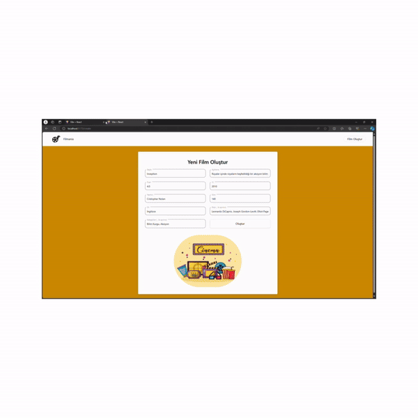

# DESCRIPTION

- This project is a simple full-stack movie application. It features an API and a frontend interface that provides functionalities for listing, filtering, deleting, and creating movie data.

# FRONTEND TECHNOLOGIES

- react
- tailwind
- react-router-dom
- react-icons
- axios
- @tanstack/react-query
- react-toastify

# BACKEND TECHNOLOGIES

- nodejs
- nodemon

# BACKEND ROUTES

- GET `/api/movies`: gives all the movies
- GET `/api/movies/ID`: gives one movie
- GET `/api/movies?query=METİN`: filtering is done
- DELETE `/api/movies/ID`: delete the movie

# PROJECT GIF

